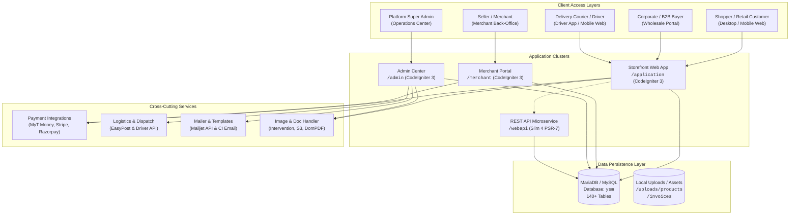
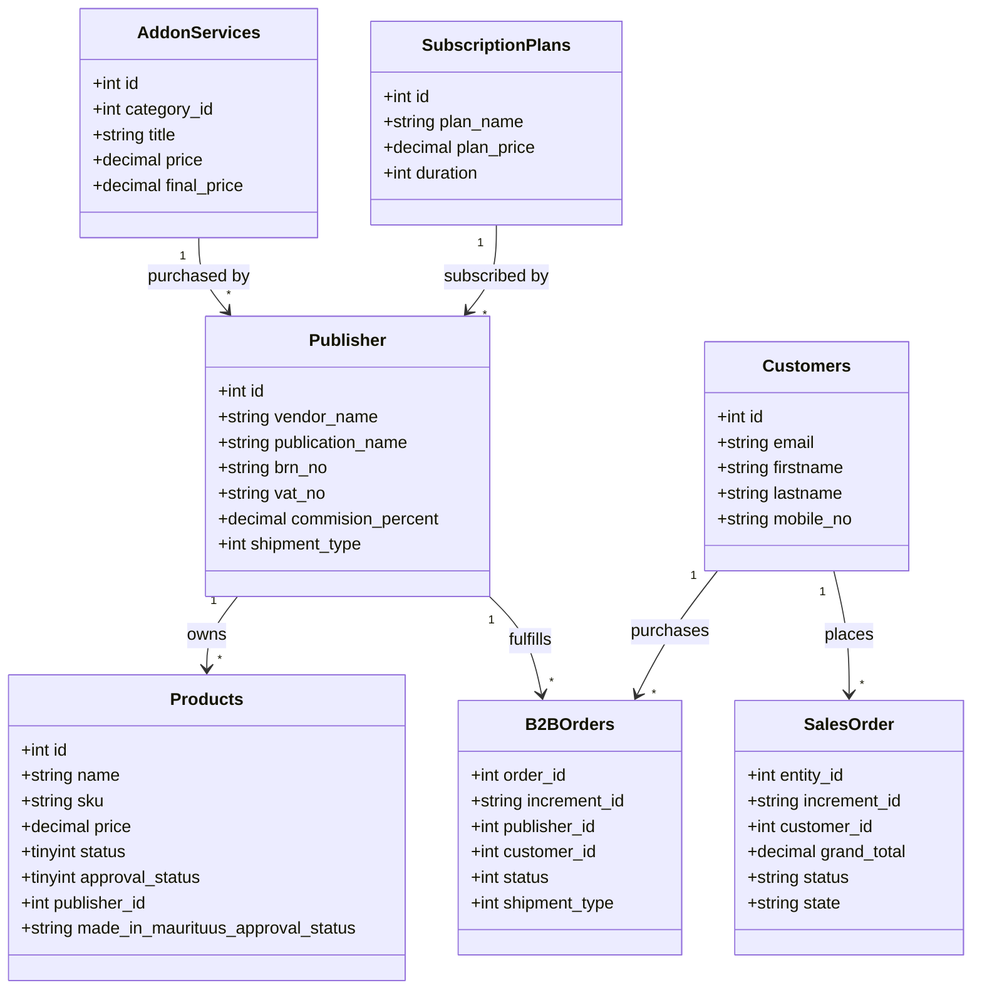
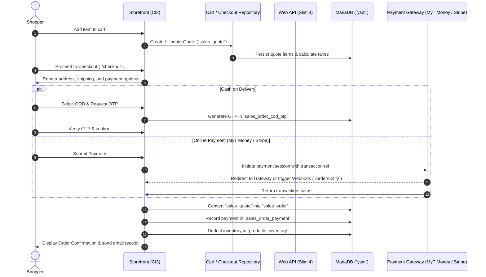
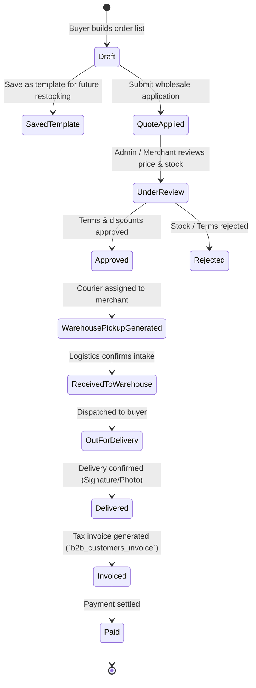

# Yellow Markets (YMStore) — Comprehensive Project Documentation

> **Official Project Technical & Architectural Reference**  
> **Database:** `ysm.sql` (MariaDB/MySQL) | **Primary Framework:** CodeIgniter 3.1 & Slim 4 | **Runtime:** PHP 8.0+ | **Target Market:** Mauritius & Regional E-Commerce

---

## 1. Executive Summary & Overview

**Yellow Markets (`ymstore`)** is a full-featured, multi-tenant B2B and B2C e-commerce marketplace platform engineered specifically for local businesses, publishers/merchants, and consumers in Mauritius (`mu.yellowmarkets.com`).

The platform provides a complete end-to-end commercial ecosystem comprising:
1. **Public E-Commerce Storefront (`application/`)**: A multi-lingual (English and French), multi-currency consumer marketplace supporting retail purchases, deals, flash sales, gift cards, product reviews, and customer accounts.
2. **B2B Wholesale Portal (`application/controllers/B2BOrdersController.php`, `admin/`, `merchant/`)**: Dedicated wholesale quotation, draft order creation, corporate customer discounting, invoice generation, and bulk order fulfillment.
3. **Merchant / Publisher Portal (`merchant/`)**: Self-service merchant back-office enabling sellers to register their shops, manage product listings and variants, purchase marketing add-on services (Daily Deals, Flash Sales, Copywriting, Photography), subscribe to store plans, track payouts, and fulfill orders.
4. **Central Administration Panel (`admin/`)**: Comprehensive back-office for marketplace operators to approve merchants, moderate product catalogs, certify ethical badges (e.g., *Made in Mauritius*, *Environment Friendly*), oversee B2B/B2C order pipelines, control logistics and driver dispatch, set VAT/tax policies, and generate financial reports.
5. **Web API Microservices (`webapi/`)**: A modular RESTful API built on **Slim Framework 4** (PSR-7 compliance, PHP-DI container, Monolog) delivering services to storefront AJAX components, mobile interfaces, and driver logistics workflows.
6. **Integrated Delivery & Driver Logistics Engine (`application/controllers/Api.php`, driver tables)**: On-demand pickup and delivery management for local couriers with mobile login, route dispatch, OTP verification, and image-based proof-of-delivery.

---

## 2. Technical Stack & Architecture

### 2.1 Technology Stack Matrix

| Component | Technology / Library | Description / Version |
| :--- | :--- | :--- |
| **Backend Runtime** | PHP 8.0 / 8.2 | Main runtime environment with strict typing and modern extensions |
| **Primary Web Framework** | CodeIgniter 3.1.x | Core framework powering Storefront, Admin Panel, and Merchant Portal |
| **REST API Framework** | Slim Framework 4 | High-performance PSR-7 micro-framework powering `webapi/` |
| **Database** | MySQL 5.7+ / MariaDB 10.3+ | Relational schema (`ysm.sql`), 140+ tables, UTF-8 Unicode |
| **Payment Gateways** | MyT Money, Stripe, Razorpay, COD | Mauritius Telecom MyT Money mobile payments, Stripe (`stripe-php ^9.6`), Razorpay, Cash on Delivery with OTP |
| **Document Generation** | DomPDF (`dompdf/dompdf ^2.0`) | Automated PDF invoice and order receipt generation |
| **Logistics & Shipping** | EasyPost (`easypost/easypost-php ^5.7`), Custom Driver Engine | Shipping charge calculations, carrier tracking, local courier dispatch |
| **Email & Communications** | Mailjet API v3 (`mailjet/mailjet-apiv3-php ^1.5`), Native Mail | Transactional notifications, OTP verification, newsletter broadcasts |
| **Cloud Storage** | League Flysystem AWS S3 (`league/flysystem-aws-s3-v3 ^2.0`) | Cloud asset management and media storage |
| **Image Processing** | Intervention Image (`intervention/image ^2.7`) | Automated product image resizing and thumbnail generation |
| **Authentication & Security**| Firebase PHP-JWT (`firebase/php-jwt ^6.11`), Google reCAPTCHA v2/v3 | API token authentication and bot prevention |
| **Frontend UI / UX** | HTML5, CSS3, Vanilla JS, jQuery, Bootstrap, Slick Carousel | Responsive layout with desktop and mobile optimization |

---

### 2.2 High-Level Architecture Diagram



---

## 3. Database Architecture & Schema Deep Dive (`ysm.sql`)

The database schema dump is provided in `ysm.sql` (~2.47 MB, 14,170 lines). It contains **140+ relational tables** representing the full enterprise domain.

### 3.1 Logical Subsystem Mapping



---

### 3.2 Key Database Subsystems & Table Breakdown

#### 1. Product Catalog & EAV (Entity-Attribute-Value) System
Manages products, attributes, variants, badges, inventory, and multimedia.
* **`products`**: Central product entity. Stores name, SKU, price, special pricing, return rules, daily deals/flash sales flags, and ethical certification badge approvals (`made_in_maurituus_approval_status`, `social_empowerment_approval_status`, `environment_friendly_approval_status`, `health_friendly_approval_status`).
* **`products_attributes`**, **`eav_attributes`**, **`eav_attributes_options`**, **`eav_attributes_visibility`**: Dynamic EAV engine allowing custom attributes (sizes, colors, materials, specifications).
* **`products_variants`**, **`products_variants_master`**: Product SKU variations.
* **`products_inventory`**: Real-time stock counts, thresholds, and back-order flags.
* **`products_media_gallery`**: Multi-image galleries with sorting and cover image flags.
* **`products_bundles`**: Bundled and composite product configurations.
* **`products_special_prices`**, **`products_special_prices_b2b`**: Time-limited retail and wholesale tier pricing.
* **`product_badges_categories`**, **`product_badges_content`**, **`products_badge_apply`**: Badge verification records for local products.
* **`category`**, **`multi_lang_category`**, **`products_category`**: Hierarchical category tree with multilingual names (English and French).

#### 2. Merchant & Multi-Vendor Subsystem
* **`publisher`**: The core vendor/merchant entity. Stores store identity, BRN (Business Registration Number in Mauritius), VAT registration, commission rates, delivery mode preference (`shipment_type`: Own Delivery vs. YM Delivery), shop geolocation (lat/long), and social integration flags.
* **`shop_details`**, **`webshop_details`**: Public storefront branding, logos, contact details, and SEO metadata.
* **`publisher_bank_deatils`**: Bank accounts for vendor settlement payouts.
* **`publisher_payment`**, **`publisher_payment_details`**: Marketplace payout logs and fee deductions.
* **`publisher_subscriptions`**: Merchant store tier subscriptions and active periods.
* **`webshop_cat_menus`**, **`webshop_custom_menus`**: Vendor-specific navigation bar configuration.

#### 3. B2C Sales, Quotes & Fulfillment Subsystem
Modeled on enterprise commerce patterns (separation of Quote and Sales Order):
* **`sales_quote`**, **`sales_quote_items`**, **`sales_quote_address`**, **`sales_quote_payment`**: Active shopper carts and checkout sessions before payment confirmation.
* **`sales_order`**, **`sales_order_items`**, **`sales_order_address`**: Confirmed purchase orders with itemized billing, taxes, discounts, and customer details.
* **`sales_order_payment`**, **`sales_order_payment_history`**, **`sales_order_payment_refunds`**: Gateway transaction logs, auth codes, and refund entries.
* **`sales_order_shipment`**, **`sales_order_shipment_details`**: Waybills, packages, tracking numbers, and fulfillment checkpoints.
* **`sales_order_return`**, **`sales_order_return_items`**: Customer return requests and RMA tracking.
* **`sales_order_replacement`**, **`sales_order_replacement_items`**: Replacement order dispatch.
* **`sales_order_escalations`**: Dispute resolutions and customer support tickets.
* **`sales_order_cod_otp`**: One-Time Passwords validating Cash on Delivery deliveries.

#### 4. B2B Wholesale & Quoting Subsystem
* **`b2b_customers`**, **`b2b_customers_details`**, **`b2b_customers_invoice`**: Registered wholesale accounts, corporate tax IDs, and credit terms.
* **`b2b_orders`**: Wholesale master orders tracking status across 20+ fulfillment states (draft, quote applied, pickup generated, warehouse received, out for delivery, delivered, paid).
* **`b2b_orders_draft`**, **`b2b_orders_draft_details`**: Draft order builder for wholesale buyers and sales reps.
* **`b2b_orders_saved`**, **`b2b_orders_saved_details`**: Saved order templates for recurring enterprise restocking.
* **`b2b_orders_applied`**, **`b2b_orders_applied_details`**: Submitted quote applications under admin review.
* **`b2b_order_shipment`**, **`b2b_orders_pickup_details`**, **`b2b_orders_delivery_details`**: Multi-leg logistics linking merchants, central warehouse, and wholesale buyers.

#### 5. Merchant Add-On Services & Platform Monetization
Provides merchants with marketing services to drive sales:
* **`addon_categories`**: Service types (Daily Deals, Flash Sales, Product Descriptions, Content Writing, Translations, Product Photos/Videos, Store Setup).
* **`addon_services`**: Specific add-on products with pricing, VAT, and bilingual descriptions (e.g., *Daily Deals - Earth*, *Flash Sales - Neptune*, *French Translation*).
* **`merchant_addon_purchases`**, **`merchant_addon_transactions`**: Merchant add-on subscriptions, payment transactions, and remaining quota.
* **`subscription_plans`**, **`subscription_features`**, **`subscription_orders`**: Recurring store hosting plans for vendors.

#### 6. Driver Logistics & Dispatch Subsystem
* **`driver_details`**: Delivery driver profiles, contact information, vehicle details, and license verification.
* **`driver_tokens`**: Authentication tokens for courier mobile app access.
* **`b2b_orders_pickup_details`**: Merchant warehouse pickup assignments, status, and proof photos.
* **`b2b_orders_delivery_details`**: Final customer delivery runs, failure notes, and delivery signature/photo evidence.

#### 7. Customer Accounts & Marketing
* **`customers`**, **`customers_address`**: Customer identity, password hashes, and multiple delivery/billing addresses.
* **`customer_signup_otp`**: SMS/Email OTP verification for account security.
* **`wishlist_items`**: Saved customer favorite products.
* **`gift_cards`**, **`gift_card_orders`**, **`gift_card_values`**, **`gift_card_transactions`**: Digital voucher codes and wallet balances.
* **`salesrule`**, **`salesrule_coupon`**: Promotion engine supporting percentage discounts, fixed reductions, and coupon codes.
* **`newsletter_subscriber`**: Marketing email subscription lists.
* **`blogs`**, **`blogs_details`**, **`testimonials`**, **`faqs`**, **`cms_pages`**: Content management system.

#### 8. Regional Localization & Master Tables
* **`multi_currencies`**: Currency codes (MUR, EUR, USD, INR), exchange rates, and formatting rules.
* **`country_master`**, **`city_master`**, **`country_state_master_in`**: Geographical lookup tables for shipping calculation.
* **`website_texts`**: Dynamic multilingual interface labels and translations.

#### 9. Administration, Security & Auditing
* **`adminusers`**, **`adminsession`**: Super administrator credentials, login timestamps, and sessions.
* **`role_master`**, **`resource_master`**, **`role_resource`**: Granular Role-Based Access Control (RBAC) matrix defining permissions per controller/action.
* **`general_logs`**: System error logs, audit events, and trace records.
* **`ci_sessions`**: Database-backed session persistence.

---

## 4. Codebase Organization & Directory Structure

```
ymstore/
├── admin/                           # Central Marketplace Administration Panel
│   ├── application/
│   │   ├── config/                  # Admin database, routes, and constants
│   │   ├── controllers/             # 69 controllers (B2B, Catalog, Reports, Roles)
│   │   ├── models/                  # Admin data access models
│   │   └── views/                   # Admin UI layouts, tables, and dashboards
│   ├── composer.json                # Admin dependencies (DomPDF, EasyPost, Flysystem)
│   └── index.php                    # Admin entry point
│
├── application/                     # Storefront Application (B2C & B2B Portal)
│   ├── config/
│   │   ├── config.php               # Base CI configuration
│   │   ├── database.php             # Database connection settings (DB: ysm)
│   │   ├── constants.php            # Global URLs, image paths, keys, Mauritian timezone
│   │   └── routes.php               # Storefront URL route mappings (450+ lines)
│   ├── controllers/                 # 44 controllers (Checkout, Products, Cart, Deals, Driver API)
│   │   ├── Api.php                  # Driver pickup & delivery API endpoints
│   │   ├── B2BOrdersController.php  # Comprehensive wholesale order management
│   │   ├── CheckoutController.php   # Multi-step checkout & payment processing
│   │   ├── DealsController.php      # Daily deals & flash sales listings
│   │   ├── HomeController.php       # Homepage, CMS pages, newsletter, merchant auth
│   │   ├── PaymentGateway.php       # MyT Money, Stripe & simulated payment gateways
│   │   ├── ProductsController.php   # Catalog browsing, filtering, and product details
│   │   └── SpecialFeaturesController.php # UPC Catalog builder & scanning utilities
│   ├── models/                      # CI Models (CommonModel, Product_model, Giftcard_model)
│   ├── presenters/                  # View presenter classes
│   ├── repositories/                # Domain repositories (UsesRestAPI trait, ProductRepository)
│   ├── ViewComponents/              # Reusable UI component renderers
│   └── views/                       # Storefront views (cart, checkout, home, profile, deals)
│
├── merchant/                        # Merchant / Publisher Portal
│   ├── application/
│   │   ├── config/                  # Merchant configs and routes
│   │   ├── controllers/             # 44 controllers (Sellerproduct, Addons, Inbound)
│   │   ├── models/                  # Merchant models (SellerProductModel, Mydocuments)
│   │   └── views/                   # Merchant portal dashboards, forms, and tables
│   ├── composer.json                # Merchant portal dependencies
│   └── index.php                    # Merchant portal entry point
│
├── webapi/                          # Slim Framework 4 REST Microservices
│   ├── app/
│   │   ├── routes.php               # Route registry loading webshop & wholesale routes
│   │   ├── settings.php             # Database and logger settings
│   │   └── dependencies.php         # PHP-DI container definitions
│   ├── src/
│   │   ├── Application/Actions/     # Action controllers (Cart, Checkout, Customer, Product)
│   │   ├── Domain/                  # Domain entities and repositories
│   │   └── Routes/                  # Route definitions (webshop, wholesale_platform, fbcuser)
│   ├── composer.json                # Slim 4, PSR-7, Monolog, PHP-DI
│   └── public/index.php             # Web API gateway entry point
│
├── public/                          # Storefront static assets (CSS, JS, Fonts, Images)
├── uploads/                         # Product images, category thumbnails, banners, invoices
├── composer.json                    # Root project Composer configuration
├── ysm.sql                          # Primary MariaDB/MySQL database schema & seed data
└── PROJECT.md                       # This technical documentation file
```

---

## 5. Core Business Workflows

### 5.1 Retail Checkout & Payment Flow (B2C)



---

### 5.2 B2B Wholesale Order Lifecycle



---

### 5.3 Driver Logistics & Courier Dispatch Flow

1. **Driver Authentication**: Courier signs in via `/driver_login` using credentials mapped to `driver_details`; receives a session token in `driver_tokens`.
2. **Route Manifest**: Driver retrieves scheduled tasks via `/get_today_route`, `/get_pickup_listing`, and `/get_delivery_listing`.
3. **Merchant Pickup**:
   - Courier navigates to merchant address.
   - Collects consignment and uploads photo proof via `/pickup_image_upload_details`.
   - Updates order status to *Pickup Completed* / *Received to Warehouse*.
4. **Final Destination Delivery**:
   - Courier navigates to buyer shipping address.
   - Collects cash (if COD) or verifies recipient.
   - Uploads delivery confirmation picture via `/delivery_image_upload_details`.
   - On delivery failure, logs reason and attempt count via `/update_failed_attempt`.

---

## 6. Configuration & Local Setup Guide

### 6.1 Prerequisites
* **Operating System**: Windows / Linux / macOS with Apache 2.4+ or Nginx
* **PHP**: Version `8.0` or `8.2` with extensions enabled:
  - `mysqli`, `pdo_mysql`, `curl`, `mbstring`, `gd`, `intl`, `xml`, `zip`, `json`
* **Database**: MySQL 5.7+ or MariaDB 10.3+
* **Composer**: v2.x installed globally

---

### 6.2 Step-by-Step Installation

#### 1. Clone & Set Up Directory
Ensure the project is located within your web server root (e.g., `D:\php-8-2-1\htdocs\ymstore`):
```bash
cd D:\php-8-2-1\htdocs\ymstore
```

#### 2. Import Database
Create a database named `ysm` and import `ysm.sql`:
```bash
mysql -u root -p -e "CREATE DATABASE ysm CHARACTER SET utf8 COLLATE utf8_unicode_ci;"
mysql -u root -p ysm < ysm.sql
```

#### 3. Install Composer Dependencies
Install vendor packages in the root, admin, merchant, and webapi directories:
```bash
# Root application dependencies
composer install

# Admin portal dependencies
cd admin && composer install && cd ..

# Merchant portal dependencies
cd merchant && composer install && cd ..

# Web API dependencies
cd webapi && composer install && cd ..
```

#### 4. Configure Database Credentials
Edit `application/config/database.php` (and corresponding files in `admin/` and `merchant/`):
```php
$db['default'] = array(
    'dsn'      => '',
    'hostname' => 'localhost',
    'username' => 'root',
    'password' => 'YOUR_DB_PASSWORD',
    'database' => 'ysm',
    'dbdriver' => 'mysqli',
    'dbprefix' => '',
    'pconnect' => false,
    'db_debug' => (ENVIRONMENT !== 'production'),
    'char_set' => 'utf8',
    'dbcollat' => 'utf8_general_ci',
);
```

#### 5. Configure Constants & Base URLs
Edit `application/config/constants.php`:
```php
// Local Development URLs
defined('BASE_URL')  || define('BASE_URL',  'http://localhost/ymstore/');
defined('BASE_URL2') || define('BASE_URL2', 'http://localhost/ymstore/merchant/');
defined('API_URL')   || define('API_URL',   'http://localhost/ymstore/webapi');
defined('IMAGE_URL') || define('IMAGE_URL', 'http://localhost/ymstore/');
```

#### 6. Web Server Configuration (Apache)
Verify that `.htaccess` is present and `mod_rewrite` is enabled. A standard virtual host setup:
```apache
<VirtualHost *:80>
    ServerName ymstore.local
    DocumentRoot "D:/php-8-2-1/htdocs/ymstore"
    <Directory "D:/php-8-2-1/htdocs/ymstore">
        Options Indexes FollowSymLinks
        AllowOverride All
        Require all granted
    </Directory>
</VirtualHost>
```

---

## 7. Key REST API Endpoints (`webapi/`)

The `webapi` microservice provides structured JSON endpoints. Key route groups registered in `webapi/app/routes.php`:

| Domain | Route Path | Description |
| :--- | :--- | :--- |
| **Catalog** | `GET /product/list` | Returns paginated products with category filters |
| **Product Detail**| `GET /product/detail/{id}` | Complete product specs, attributes, and variant options |
| **Cart** | `POST /cart/add`, `POST /cart/update` | Adds items to active quote and recalculates totals |
| **Checkout** | `POST /checkout/process` | Validates shipping address and initializes payment |
| **Currencies** | `GET /currency/list` | Active currencies and conversion multipliers |
| **Promotions** | `GET /featured-products`, `GET /pre-launch` | Curated promotional product lists |
| **Customer** | `POST /customer/login`, `POST /customer/register` | Authentication and profile management |
| **Wholesale** | `/wholesale_platform/...` | B2B quotation and draft order actions |
| **Couriers** | `/driver_login`, `/get_today_route` | Driver assignments, pickup and delivery tracking |

---

## 8. Scheduled Cron Jobs & Maintenance

The platform includes automated maintenance scripts located in `application/controllers/CronController.php` and `admin/application/controllers/CronController.php`:

1. **Daily Deals & Flash Sales Expiration**:
   - Checks `products.daily_deal_ends_at` and `flash_sale_ends_at`.
   - Reverts special prices once the promotional window closes.
2. **Out of Stock Automation (`CronOutOfStockController.php`)**:
   - Identifies items with inventory `<= 0` and toggles availability flags or notifies sellers.
3. **Abandoned Cart Follow-Up**:
   - Queries non-converted quotes in `sales_quote` older than 24 hours to trigger reminder emails.
4. **Subscription Renewals**:
   - Verifies merchant validity in `publisher_subscriptions` and applies grace periods or status updates.

Recommended Linux crontab configuration:
```cron
# Hourly catalog & deal expiration check
0 * * * * php /var/www/ymstore/index.php CronController expire_deals > /dev/null 2>&1

# Daily stock & abandoned cart maintenance
0 2 * * * php /var/www/ymstore/index.php CronController daily_maintenance > /dev/null 2>&1
```

---

## 9. Security, Quality & Governance

1. **Database Credentials & Environment**: Always set `ENVIRONMENT` in `index.php` to `'production'` on live servers to suppress verbose backtraces and error disclosures.
2. **Access Control (RBAC)**: All administrative routes are verified against `adminusers`, `role_master`, and `role_resource` permissions in controller constructors.
3. **Input Sanitization**: Database queries utilize CodeIgniter Query Builder parameter binding to guard against SQL injection.
4. **Payment Security**: Raw credit card details are never persisted locally. All gateway communications (Stripe, MyT Money, Razorpay) are handled through secure tokens and server-to-server webhook callbacks.
5. **CSRF & Bot Protection**: Protected customer forms include CSRF tokens and Google reCAPTCHA v2/v3 validation.

---

*Document generated automatically for Yellow Markets (YMStore) codebase analysis & database specification.*
