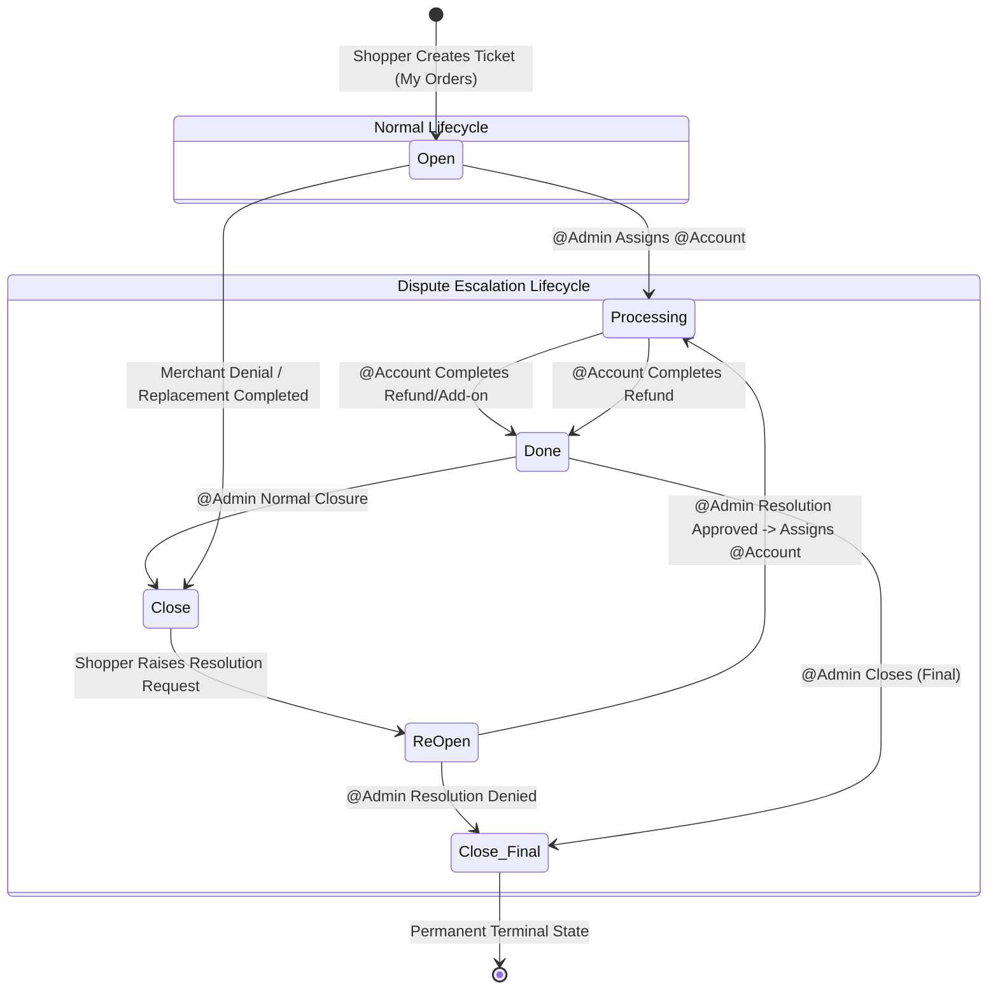

# Backend & Workflow Analysis: Order Resolution & Ticket System
## Agent 3 — Backend / Workflow Agent Report

**Agent:** Agent 3 — Backend / Workflow Agent  
**System:** Yellow Markets (YM Store / PHP 8.2 CodeIgniter 3 MVC)  
**File:** `docs/order-resolution/backend-analysis.md`  
**Status:** Comprehensive Analysis Complete

---

## 1. Existing Controllers, Models, Routes & APIs

### 1.1 Existing Controllers
- **Shopper Application (`application/controllers/`):**
  - `MyProfileController.php`: Hosts legacy `helpDesk()`, `helpDeskPost()`, and `viewTicket()`. Treats tickets as general inquiries, detached from item fulfillment.
  - `MyOrdersController.php`: Manages `getOrders()`, `getOrderItems()`, `addReturnRequest()`, and `addReplacementRequest()`. Lacked an entry point to trigger an order resolution ticket.
- **Merchant Portal (`merchant/application/controllers/`):**
  - `UserController.php`: Hosts `shopper_helpdesk()`, `merchant_helpdesk()`, `update_help_desk()`, and `close_ticket()`. Only permitted basic text replies and closing without structured decision actions.
  - `B2BOrdersController.php`: Manages `payouts()` and `checkPayoutEligibility()`. Checked returns/replacements, but had no lock for open disputes.
- **Admin Portal (`admin/application/controllers/`):**
  - `CustomerController.php`: Hosts `help_desk()`, `shopper_help_desk()`, `merchant_help_desk()`, `update_help_desk()`, and `close_ticket()`. Lacked department assignment (`@Account`) or dispute resolution arbitration.
  - `B2BOrdersController.php`: Manages administrator payout runs and eligibility checking.

### 1.2 Existing Models
- `CommonModel.php` (`application/`, `merchant/`, `admin/`): Legacy querying of `help_desk` records filtered by `customer_id` or `merchant_id`.
- `B2BOrdersModel.php` (`merchant/`, `admin/`): Payout order querying.
- `ReturnOrderModel.php` & `sales_order_replacement`: Separate return/replacement tracking models.
- `Notification_model.php`: Insertion into `notifications` table.

### 1.3 Existing Routes
- Shopper: `help-desk` -> `MyProfileController/helpDesk`
- Merchant: `help_desk/shopper` -> `UserController/shopper_helpdesk`, `help_desk/merchant` -> `UserController/merchant_helpdesk`
- Admin: `help_desk/shopper` -> `CustomerController/shopper_help_desk`, `help_desk/merchant` -> `CustomerController/merchant_help_desk`

### 1.4 Existing APIs & AJAX Endpoints
- Shopper: `/MyProfileController/helpDeskPost` (JSON response)
- Merchant: `/UserController/update_help_desk` (POST redirect)
- Admin: `/CustomerController/update_help_desk` (POST redirect)

---

## 2. Current Status Logic & Identified Gaps

### Existing Status Model
The legacy system relied on a single `tinyint(1)` status:
- `0`: Not Opened
- `1`: Open
- `2`: Closed

### Missing Status Logic
The legacy architecture could not represent intermediate operational phases or arbitration states:
- Missing `Processing`: When Admin routes to Account or investigates dispute.
- Missing `Done`: When Account deducts refund from 15-day hold-back sales or confirms replacement Add-on.
- Missing `ReOpen`: When Shopper escalates a closed dispute via a Resolution Request.
- Missing `Close (Final)`: When Admin makes a permanent, unappealable dispute determination.

---

## 3. Required State Machine Architecture

### State Definitions
- **`Open`**: New Shopper/Merchant ticket.
- **`Processing`**: Under @Admin investigation or @Account financial processing.
- **`Done`**: Strictly set by @Account after successful refund deduction or Add-on fulfillment.
- **`Close`**: Strictly set by @Admin for normal ticket closure.
- **`ReOpen`**: Strictly set by Shopper through a formal Resolution Request.
- **`Close (Final)`**: Strictly set by @Admin after final resolution decision.

---

## 4. Analysis of the 9 Core Workflows

### Workflow 1: Refund Approved
- **Trigger:** Merchant clicks `Refund Approved` on an `Open` ticket.
- **Actor:** Merchant (`merchant_id = $_SESSION['LoginID']`).
- **Validations:** Ticket status must be `Open`. `merchant_action` must be `none`.
- **Transitions:**
  1. Ticket `merchant_action = 'refund_approved'`.
  2. Notifications sent to Shopper and @Admin.
  3. @Admin reviews and assigns ticket to `@Account`. Status updates: `Open → Processing`.
  4. `@Account` checks Merchant 15-day hold-back sales balance and deducts refund amount.
  5. `@Account` clicks `Done`. Status updates: `Processing → Done`.
  6. `@Admin` verifies and clicks `Close`. Status updates: `Done → Close`, `is_active_dispute = 0`.
  7. Notifications sent to Merchant & Shopper. Normal payout restored.

### Workflow 2: Refund Denied
- **Trigger:** Merchant clicks `Refund Denied` on an `Open` ticket.
- **Actor:** Merchant.
- **Validations:** Mandatory denial rationale text required.
- **Transitions:**
  1. Ticket `merchant_action = 'refund_denied'`, `status_code = 'Close'`, `is_active_dispute = 0`.
  2. Sub-order evaluated; if no other disputes, payout restored.
  3. Shopper and @Admin notified. Shopper is presented with the option to submit a **Resolution Request**.

### Workflow 3: Replacement Approved – Own Delivery
- **Trigger:** Merchant clicks `Replacement Approved` and selects radio option `Own Delivery`.
- **Actor:** Merchant.
- **Validations:** Ticket status must be `Open`. Delivery option must be `own_delivery`.
- **Transitions:**
  1. `merchant_action = 'replacement_approved'`, `delivery_option = 'own_delivery'`.
  2. Shopper notified that replacement is approved via merchant direct delivery.
  3. Merchant prepares and delivers item, then clicks `Replacement Completed`.
  4. Ticket updates: `status_code = 'Close'`, `is_active_dispute = 0`. Payout restored.

### Workflow 4: Replacement Approved – Self Pickup
- **Trigger:** Merchant clicks `Replacement Approved` and selects radio option `Self Pickup`.
- **Actor:** Merchant.
- **Validations:** Delivery option must be `self_pickup`.
- **Transitions:**
  1. `merchant_action = 'replacement_approved'`, `delivery_option = 'self_pickup'`.
  2. Shopper notified that replacement item is ready for collection at merchant store.
  3. Merchant clicks `Replacement Completed`.
  4. Ticket updates: `status_code = 'Close'`, `is_active_dispute = 0`. Payout restored.

### Workflow 5: Replacement Approved – YM Delivery
- **Trigger:** Merchant clicks `Replacement Approved` and selects radio option `YM Delivery`.
- **Actor:** Merchant.
- **Validations:** Requires Yellow Markets delivery fleet logistics.
- **Transitions:**
  1. `merchant_action = 'replacement_approved'`, `delivery_option = 'ym_delivery'`.
  2. @Admin notified. @Admin assigns to `@Account` (`Open → Processing`).
  3. `@Account` issues request for Merchant to purchase replacement delivery Add-on.
  4. Merchant purchases Add-on (`merchant_addon_purchases`).
  5. Logistics fulfilled; marked `Replacement Completed`.
  6. @Admin clicks `Close`. Status updates: `Done → Close`, `is_active_dispute = 0`. Payout restored.

### Workflow 6: Replacement Denied
- **Trigger:** Merchant clicks `Replacement Denied`.
- **Actor:** Merchant.
- **Validations:** Mandatory denial rationale required.
- **Transitions:**
  1. `merchant_action = 'replacement_denied'`, `status_code = 'Close'`, `is_active_dispute = 0`.
  2. Shopper and @Admin notified. Shopper eligible for **Resolution Request**.

### Workflow 7: Shopper Resolution Request (Dispute Escalation)
- **Trigger:** Shopper clicks `Resolution Request` on a `Close` ticket.
- **Actor:** Shopper (`customer_id = $_SESSION['LoginID']`).
- **Validations:**
  - Ticket status must be `Close`.
  - Ticket must NOT have `resolution_status = 'resolution_denied'`.
  - Mandatory dispute reasoning required (min 15 characters).
- **Transitions:**
  1. `status_code = 'ReOpen'`, `resolution_status = 'resolution_requested'`, `is_active_dispute = 1`.
  2. Payout lock immediately reinstated (`payout_status = 3` On Hold).
  3. @Admin notified urgently.

### Workflow 8: Resolution Approved (Admin)
- **Trigger:** @Admin investigates dispute and overrules merchant refusal, clicking `Resolution Approved`.
- **Actor:** @Admin (`UserRole` = Administrator / Super Admin).
- **Validations:** Ticket status must be `ReOpen`.
- **Transitions:**
  1. Status updates: `ReOpen → Processing`, `resolution_status = 'resolution_approved'`, `assigned_role = 'Account'`.
  2. `@Account` processes customer refund from Merchant 15-day hold-back balance.
  3. `@Account` clicks `Done`. Status updates: `Processing → Done`.
  4. `@Admin` clicks `Close (Final)`. Status updates: `Done → Close (Final)`, `is_active_dispute = 0`.
  5. Both parties notified. Final closure terminates dispute permanently.

### Workflow 9: Resolution Denied (Admin)
- **Trigger:** @Admin investigates dispute and upholds merchant refusal, clicking `Resolution Denied`.
- **Actor:** @Admin.
- **Validations:** Ticket status must be `ReOpen`. Rationale mandatory.
- **Transitions:**
  1. Status updates immediately to `Close (Final)`.
  2. `resolution_status = 'resolution_denied'`, `is_active_dispute = 0`.
  3. Payout restored according to standard cooling-off schedule.
  4. Shopper is permanently blocked from submitting another Resolution Request.

---

## 5. Invalid Transition Matrix & Prevention

| Proposed Transition | Precondition Required | Enforced Guard / Response |
|---|---|---|
| `Open → Done` | Status must be `Processing` | **REJECTED (400):** Only `@Account` can mark `Done` from `Processing`. |
| `Open → Close (Final)` | Status must be `ReOpen` or post-resolution `Done` | **REJECTED (400):** Normal tickets close to `Close`, not `Close (Final)`. |
| `Close → Done` | Status must be `Processing` | **REJECTED (400):** Direct jump prohibited. |
| `Close (Final) → ReOpen`| Must NOT be `Close (Final)` | **REJECTED (403):** Terminal state; no further escalation permitted. |
| Non-account setting `Done` | Role must be `Account` / `Super Admin` | **REJECTED (403):** Role unauthorized. |
| Merchant clicking `Replacement Completed` without approved delivery | `merchant_action = 'replacement_approved'` AND valid delivery option | **REJECTED (400):** Action button disabled and rejected server-side. |

---

## 6. Required Changes & File Map

1. **Service Layer:**
   - Create `application/services/OrderResolutionService.php` to encapsulate all 9 workflows, transition validations, notification dispatches, and payout hold releases.
2. **Data Layer:**
   - Create `application/models/OrderResolutionModel.php` to manage ticket persistence, unique ID generation (`RES-[INC]-[DATE]-[RAND]`), threaded messages, and hold-back queries.
3. **Shopper Controller:**
   - Create `application/controllers/OrderResolutionController.php` (`create`, `view`, `reply`, `request_resolution`).
4. **Merchant Controller:**
   - Create `merchant/application/controllers/OrderResolutionController.php` (`index`, `view`, `reply`, `action`).
5. **Admin Controller:**
   - Create `admin/application/controllers/OrderResolutionController.php` (`index`, `view`, `reply`, `assign_account`, `account_done`, `admin_close`, `admin_resolve`, `admin_close_final`).
6. **Financial Controller Updates:**
   - Update `B2BOrdersController::checkPayoutEligibility` and `payouts()` in both merchant and admin to enforce the active dispute lock and restoration rules.

---

## 7. Validation Requirements

- **Input Sanitization:** XSS clean on all user messages and refusal rationales.
- **Upload Restrictions:** File size <= 5MB; mime types: `image/jpeg`, `image/png`, `image/webp`, `application/pdf`.
- **Scoping Integrity:** Require `Ticket ID` + `Order ID` + `Order Item ID` + `Product ID` + `Merchant ID` on creation and dispute escalation.
- **Cooldown Window:** Reject duplicate email and notification triggers generated within a 300-second cooldown window.

---

## 8. Potential Regression Risks & Mitigations

1. **Legacy Tickets Rendering:**
   - Existing tickets with status `0`, `1`, `2` will map dynamically to `Open` and `Close`.
2. **Multi-Vendor Payout Contamination:**
   - Payout lock strictly filters by `merchant_id` and `b2b_order_id`, ensuring Merchant B's payouts are not held when a ticket is opened against Merchant A.
3. **Database Consistency:**
   - All state transitions and balance deduction logs execute inside CodeIgniter database transactions (`trans_start()` / `trans_complete()`).
