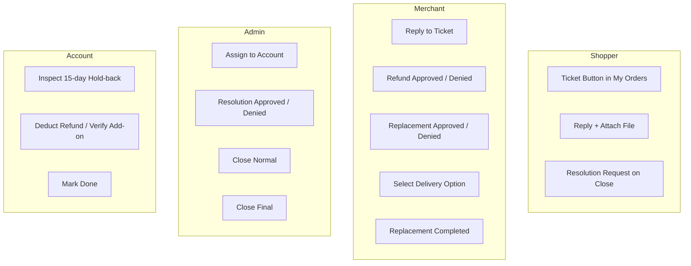

# Frontend & UX Analysis: Order Resolution & Ticket System
## Agent 4 — Frontend / UX Agent Report

**Agent:** Agent 4 — Frontend / UX Specialist  
**System:** Yellow Markets (YM Store / PHP 8.2 CodeIgniter 3 MVC)  
**File:** `docs/order-resolution/frontend-analysis.md`  
**Status:** Comprehensive Analysis Complete

---

## 1. Existing Screens & Views

### 1.1 Shopper Application Views (`application/views/`)
- **My Orders Screen:**
  - `application/views/components/order/customer_general_orders.php`: Renders the customer order list and order items.
  - *Legacy State:* Displayed action buttons (`View Order`, `Cancel`, `Return`, `Replacement`). Lacked an item-level `[Ticket]` button to initiate order dispute resolution.
- **Legacy Helpdesk Screen:**
  - `application/views/help_desk.php`: Legacy ticket submission and message list.
  - *Legacy State:* Only offered a generic text inquiry form. Detached from `order_id`, `order_item_id`, `product_id`, and `merchant_id`.

### 1.2 Merchant Portal Views (`merchant/application/views/`)
- **Helpdesk Ticket List:**
  - `merchant/application/views/shopper_helpdesk.php` & `merchant_helpdesk.php`.
  - *Legacy State:* Standard tabular listing with simple text status (`0=Not Opened`, `1=Open`, `2=Closed`). Lacked decision action triggers (`Refund Approved/Denied`, `Replacement Approved/Denied`, `Replacement Completed`).
- **Ticket Thread View:**
  - Embedded reply box with single "Reply" button. No delivery method dropdown or structured workflow actions.

### 1.3 Admin Portal Views (`admin/application/views/`)
- **Admin Helpdesk List:**
  - `admin/application/views/help_desk.php`, `shopper_help_desk.php`, and `merchant_help_desk.php`.
  - *Legacy State:* Displayed all tickets without role-based operational queues (`@Account` vs `@Admin`), lacking department filtering or dispute escalation indicators.
- **Admin Ticket View:**
  - Simple message reply interface. Lacked dispute arbitration controls (`Resolution Approved`, `Resolution Denied`, `Close`, `Close Final`, `Assign to Account`).

### 1.4 @Account Views
- *Legacy State:* **No dedicated Order Resolution interface existed for `@Account`.** Accounts personnel had no view into tickets requiring 15-day hold-back balance deduction or Add-on verification.

---

## 2. Existing JavaScript & AJAX

### 2.1 Existing Shopper AJAX
- `application/views/help_desk.php`: Used jQuery `$.ajax` submitting form data serialized to `/MyProfileController/helpDeskPost`. Returned JSON `{status: true/false, message: ...}`.
- Lacked file upload progress, multi-merchant product scoping, and dynamic status badge updates.

### 2.2 Existing Merchant & Admin AJAX
- Both portals used legacy synchronous HTTP POST form submissions (`/UserController/update_help_desk` and `/CustomerController/update_help_desk`) triggering full-page browser reloads rather than responsive asynchronous updates.

---

## 3. Detailed Inspection by User Role

### 3.1 Shopper Interface
- **My Orders (`customer_general_orders.php`):**
  - Requires an item-level `[Ticket]` button beside each product row.
  - If a ticket already exists for that item, displays an active status badge linking to the conversation view.
- **Ticket Creation Modal:**
  - Triggered by the `[Ticket]` button with pre-populated, read-only order number (`increment_id`) and product details.
  - Fields:
    - **Category (Mandatory):** `Delivery`, `Refund`, `Replacement`, `Others`.
    - **Priority (Mandatory):** `Low`, `Medium`, `High`, `Urgent`.
    - **Message (Mandatory):** Minimum 10 characters.
    - **Attachment (Optional):** Image/PDF file upload (max 5MB) with preview.
  - Submits via AJAX with loading spinner on the submit button.
- **Ticket Details & Conversation View:**
  - Header banner displaying composite key: Ticket ID, Order Number, Product Name, Merchant Name, Status Badge.
  - Threaded conversation bubbles distinguishing Shopper, Merchant, Admin, and Account.
  - Reply box with file attachment support.
- **Resolution Request (Dispute Escalation):**
  - Appears **only** when ticket is in status `Close` and `resolution_status != 'resolution_denied'`.
  - Prompts shopper for escalation rationale (minimum 15 characters).
  - Submits via AJAX, transitioning ticket to `ReOpen` and reinstating active dispute indicators.

### 3.2 Merchant Interface
- **Ticket List (`shopper_helpdesk.php`):**
  - Displays tickets scoped strictly to `merchant_id = $_SESSION['LoginID']`.
  - Shows 6 distinct status badges (`Open`, `Processing`, `Done`, `Close`, `ReOpen`, `Close (Final)`).
- **Ticket Details:**
  - Threaded conversation with message history and attachment viewers.
  - Reply form for merchant communications.
- **Decision Action Bar (Visible in `Open` status):**
  - **Refund Approved:** Modal confirmation -> Notifies Shopper and Admin -> Routes to `@Account`.
  - **Refund Denied:** Prompts mandatory denial reason -> Sets status to `Close` -> Enables Shopper `Resolution Request`.
  - **Replacement Approved:** Triggers dynamic delivery method dropdown.
  - **Replacement Denied:** Prompts mandatory denial reason -> Sets status to `Close`.
- **Delivery Option Dropdown:**
  - **Strict Condition:** **Only displayed after `Replacement Approved` is clicked.**
  - Options:
    1. `Own Delivery` (Merchant direct logistics)
    2. `Self Pickup` (Customer collection at merchant store)
    3. `YM Delivery` (Yellow Markets platform delivery fleet)
- **Replacement Completed Button:**
  - **Strict Condition:** **Only displayed after `Replacement Approved` has been executed AND a valid delivery option is selected.**
  - Prompts for dispatch notes / tracking reference.
  - Marks replacement complete -> Updates status to `Close` -> Restores payout eligibility.

### 3.3 @Admin Interface
- **Ticket List & Dashboard:**
  - Comprehensive ticket management with filters: Status, Department (`Admin` / `Account`), Category, Priority.
  - High-visibility badge for escalated disputes (`ReOpen`).
- **Ticket Details & Decision Controls:**
  - Threaded conversation with audit trail log.
  - **Assign to Account:** Available on `Open`, `Processing`, and `ReOpen` -> Sets assigned department to `@Account` and updates status to `Processing`.
  - **Resolution Approved:** Available on `ReOpen` -> Overrules merchant denial -> Routes to `@Account` (`Processing`) for refund hold-back deduction.
  - **Resolution Denied:** Available on `ReOpen` -> Upholds merchant denial -> Sets status to `Close (Final)`.
  - **Close (Normal):** Available on `Open` or `Done` -> Moves status to `Close`.
  - **Close Final:** Available on `Done` (post-resolution) or directly upon `Resolution Denied` -> Permanent terminal closure.

### 3.4 @Account Interface
- **Queue / Dashboard:**
  - Filtered queue displaying tickets assigned to `@Account` with status `Processing`.
- **Refund & Add-on Processing Box:**
  - Displays Merchant 15-day hold-back sales balance.
  - Displays refund calculation and deduction breakdown.
  - For `YM Delivery`: Displays status of Merchant Replacement Add-on purchase.
- **Done Button:**
  - **Strict Role Gating:** **Only visible to `@Account` / Super Admin.**
  - Only active when status is `Processing`.
  - Confirms financial deduction / Add-on completion -> Updates status to `Done`.

---

## 4. Missing UI Components & Identified Gaps

1. **Missing Item-Level Trigger:** My Orders view had no mechanism to pass `order_item_id`, `product_id`, and `merchant_id` into a ticket modal.
2. **Missing Dispute Escalation UI:** Shoppers had no interface to submit a "Resolution Request" after a merchant denial.
3. **Missing State-Gated Merchant Controls:** The merchant portal lacked conditional UI gating for the replacement delivery options and completion triggers.
4. **Missing Financial Action Panel:** The admin/account portal lacked the hold-back balance preview and `Done` action button.
5. **Missing Unified Status Badges:** Six distinct workflow statuses lacked standardized CSS badges across all three portals.

---

## 5. Required Frontend Changes & Implementation Map

| File | Change Description |
|---|---|
| `application/views/components/order/customer_general_orders.php` | Add `[Ticket]` button and existing ticket status badge per order item row. Include ticket creation modal. |
| `application/views/order_resolution/ticket_modal.php` | Create reusable Shopper ticket creation modal with category, priority, and file upload. |
| `application/views/order_resolution/conversation.php` | Create unified responsive Shopper ticket conversation view with reply box and `Resolution Request` trigger. |
| `merchant/application/views/order_resolution/conversation.php` | Create Merchant ticket conversation view with decision action bar, conditional delivery dropdown, and `Replacement Completed` gating. |
| `admin/application/views/order_resolution/index.php` | Create Admin/Account dashboard with status badges, role queues, and dispute filters. |
| `admin/application/views/order_resolution/conversation.php` | Create Admin/Account conversation view with `@Account` assignment, hold-back financial processing panel, and `Close (Final)` controls. |

---

## 6. Validation Gaps & Client-Side Rules

- **Message Length:** Textareas must enforce minimum 10 characters for replies and 15 characters for dispute escalation / denial rationales.
- **File Upload:** Restrict to `.png`, `.jpg`, `.jpeg`, `.webp`, `.pdf` with client-side file size verification (<= 5MB).
- **Double-Submit Prevention:** All AJAX submit buttons must disable immediately on click and display a spinning loader (`fa-spinner fa-spin`).
- **Gating Validation:** The `Replacement Completed` button must remain hidden and disabled until both `Replacement Approved` and a delivery radio/dropdown option are selected.

---

## 7. Role Visibility & Security Matrix

- **Strict Gating:** `@Account` controls must never appear in Merchant or Shopper views.
- **Admin Arbitration:** `Resolution Approved/Denied` and `Close (Final)` controls are strictly restricted to Administrators.

---

## 8. UX Risks & Mitigations

1. **Shopper Confusion on Denials:**
   - *Risk:* Shopper assumes merchant denial is the end of the line.
   - *Mitigation:* Display a clear, prominent callout on `Close` tickets: *"Merchant has denied the request. If you disagree, you can submit a formal Resolution Request for @Admin arbitration."*
2. **Accidental Multi-Submission:**
   - *Risk:* Rapid clicks during network latency creating duplicate tickets or replies.
   - *Mitigation:* JavaScript button debounce + backend idempotency window (300-second cooldown).
3. **Mobile Responsiveness:**
   - *Risk:* Wide action button bars breaking layout on smartphones.
   - *Mitigation:* Responsive flex-wrap button groups and collapsible action panels optimized down to 360px viewport width.
